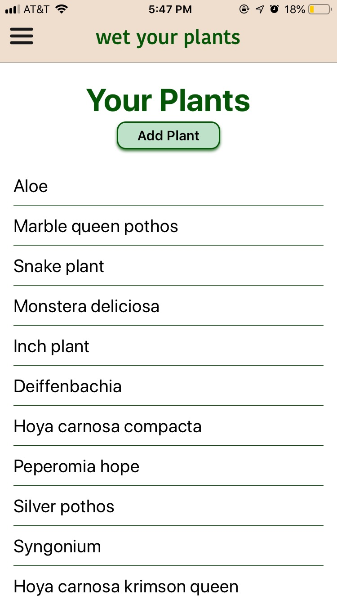
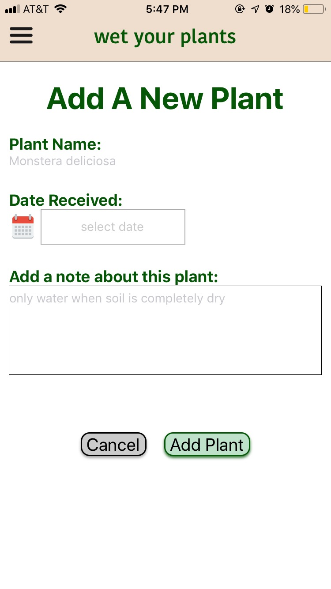
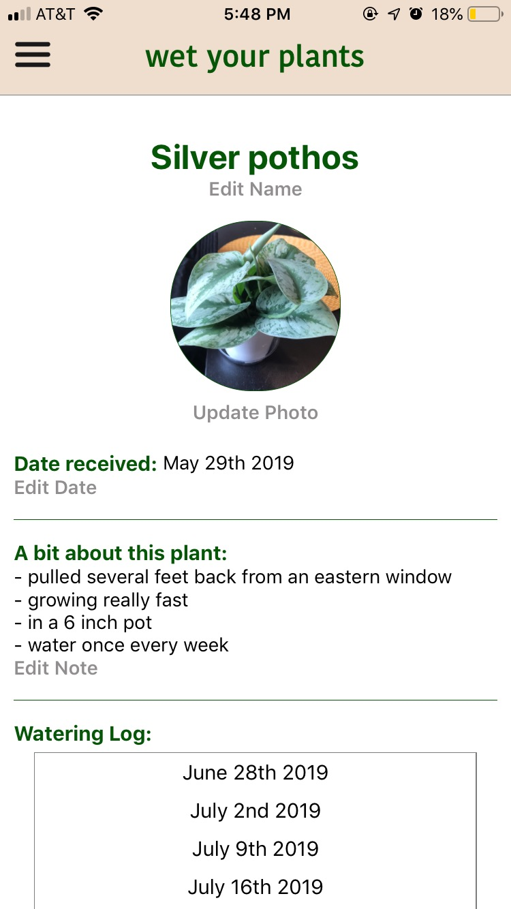
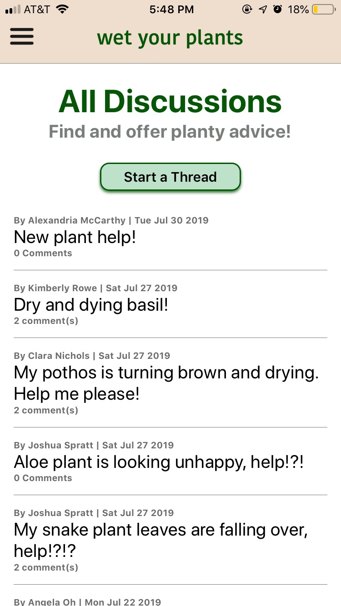
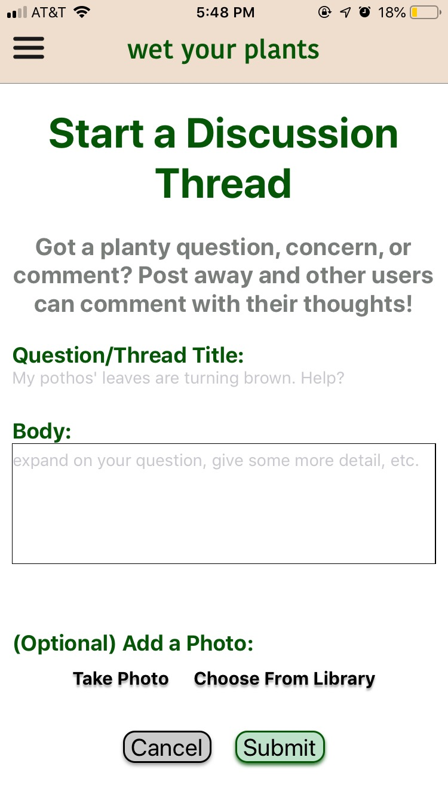
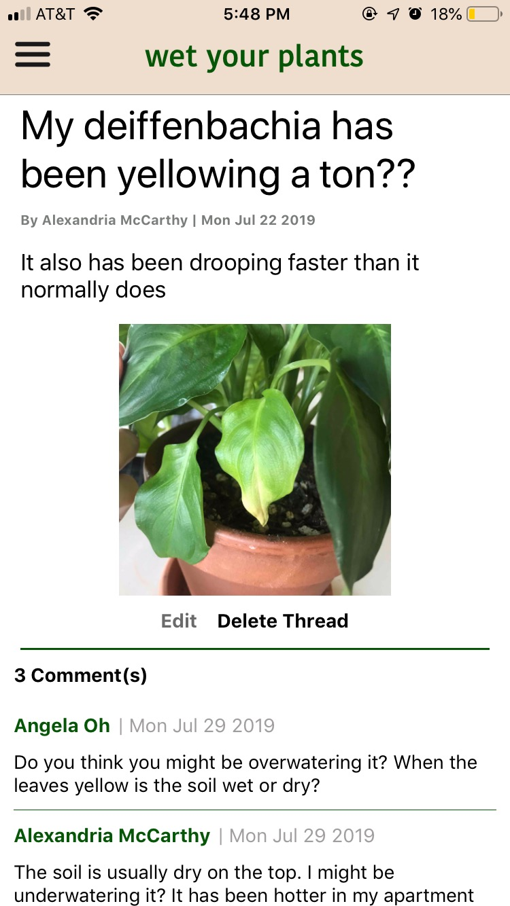
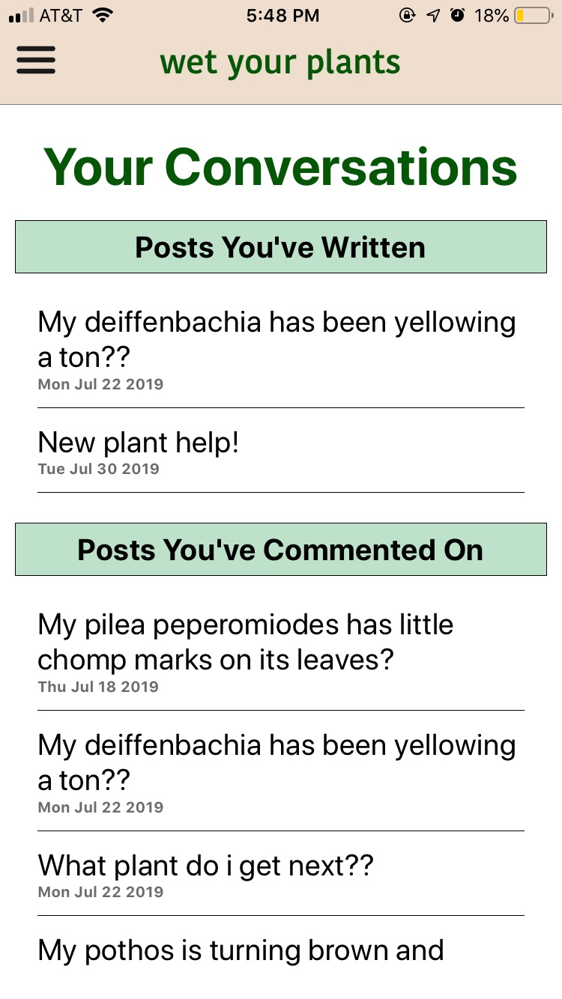

# :leaves: wet your plants :seedling:
a mobile app for the houseplant community

****************

Keep track of all your houseplants and their needs as well as source the Wet Your Plants community for tips and tricks for keeping your plant healthy and happy.

You can create plant profiles for all your plants where you can keep a photo, notes, and watering and fertilizing logs. 

You can also browse discussion forums created by other users for plant-related questions and information. You can comment on any post as well as create your own thread. 

This was created as a final capstone project for Ada Developers Academy Cohort 11. 

## Demo and examples

Plant List Page:

Add a new plant:

Plant Profile Page:

Discussion List:

Start a new discussion thread:

Discussion thread page:

Your Conversation page:

## Tech stack
- Front-end: React Native, Expo, React-Navigation
- Back-end: Google Firebase

## Installation

If you want to view the app on your phone, download the Expo.io app from the app store. Otherwise, download the XCode simulator for iOS or the Android emulator for Android. 

1. Git clone this project
2. cd capstone-project

3. Make sure you have [Node.js] installed (at the time of publishing, Expo recommends version 10 (but 8 or a newer stable version will do).
4. Install node packages with $npm install
5. Install the Expo CLI: $npm install -g expo-cli
6. Run the app in the terminal with npm start 
      - this will open up the Metro Bundler in your browser. From here you can take a picture of the provided QR code (in the Camera app on iOS or directly in the Expo app on Android) which will open up the project on your phone in the Expo app.

*Install dependencies:*

- Firebase: $npm install firebase

- React Navigation: $npm install react-navigation

- Expo permissions: $npm install expo-permissions

- Expo Image-Picker: $npm install expo-image-picker

- React Native DatePicker: $npm install react-native-datepicker

- Lodash: $npm install lodash

*To setup Firebase:*
  
- follow the firebase [set-up guide]
    1. create a project in Firebase 
    2. choose the web option 
    3. Under Add Firebase SDK, copy everything between the <script> tag with your firebaseConfig
    4. Paste this into a file you create called /src/config.js. Make sure you export it.
    
    
      const firebaseConfig = {
    
        apiKey: "",

        authDomain: "",

        databaseURL: "",

        projectId: "",

        storageBucket: "",

        messagingSenderId: "",

        appId: ""
      
      };

      export default firebaseConfig;
    
    
    -> you will also need to make sure you have a storageBucket set up. In your firebase console, go to storage and follow the set up there
    
*To setup Google OAuth with Firebase x Expo:*

- steps were taken from the Expo documentation for [Google Sign-In]
  1. Click on [Credentials] in the Expo docs to get to your Google credentials page
  2. Make sure your project is selected (in the top, click the dropdown menu and click "all" to find your firebase project)
  3. Once on your project, click on Create Credentials
  4. Click on OAuth Client ID
  5. Select application type (this project is currently set up for iOS, so choose iOS)
  6. Copy and paste "host.exp.exponent" into the Bundle ID section (taken from Expo docs)
  7. Click Create
  8. Paste your resulting iOS client id into corresponding section (iosClientId) in src/Auth.js (in the function signInWithGoogleAsync)

[Google Sign-In]: https://docs.expo.io/versions/latest/sdk/google/
[set-up guide]: https://firebase.google.com/docs/web/setup
[Node.js]: https://nodejs.org/en/download/
[Credentials]: https://console.developers.google.com/apis/credentials
    
